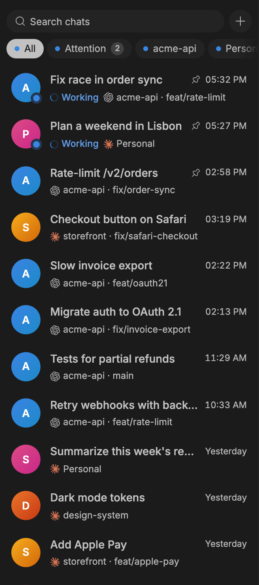
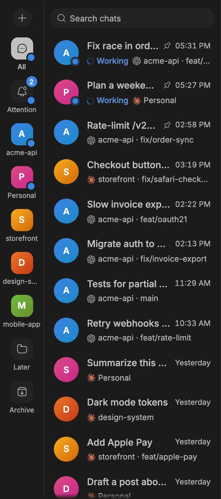
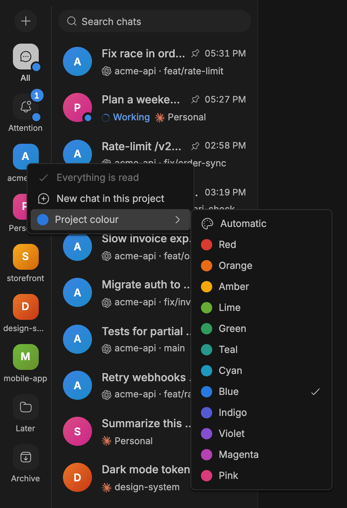

# Chat Sidebar for bb

A messenger-style sidebar for [bb](https://getbb.app). Each task gets one row
with its live status. Folders show what needs you, each project has its own
colour, and search covers every chat. Clicking a row opens bb's own thread
view, so nothing about how bb works changes.

<p>
  
  
  
</p>

## Features

- **One row per task.** Sub-agents and forks fold into their parent chat and
  lift its status. The row counts busy sub-agents, and its menu jumps to any
  of them.
- **Live status.** You can see at a glance whether a chat needs you
  (a question, an approval, a failed send, an error), is working (and on what:
  a turn, a workflow, background agents, a goal, the environment), finished
  unread, or holds an unsent draft. Statuses that other plugins set on a row
  show up too.
- **Folders.** All, Attention (waiting, working, or unread), one per project in
  order of use, one per bb section, and Archive. Each has an unread badge and
  a status dot. Show them as tabs above the list, or as a Telegram-style rail
  on the left that scrolls on its own.
- **Project colours.** Clear colours are assigned automatically, so a few
  projects never look alike. Right-click a project to pick one of 12. The pick
  syncs across your devices.
- **New chat in context.** The **+** starts a chat in the open project or
  section. Right-click it to choose any project.
- **Search** by title, project, branch, or sub-agent.
- **Messenger order.** Pinned chats sit on top in your order (drag to
  reorder), the rest follow by latest activity. A back-to-top button appears
  once you scroll.
- **Everything bb's own row does:** ⌘-click or drag to split, ⌘1…9 and
  next/previous shortcuts, rename in place, pin, read/unread, copy link,
  archive, delete.
- **English and Russian.** The default follows your system language.

## Install

```sh
bb plugin install git:https://github.com/seoperin/bb-plugin-chat-sidebar.git@^0.1.0
```

bb uses the first thread-list plugin you install. If you already chose
another one, pick **Chats** under **Settings → Appearance → Sidebar**. Pick
bb's own list there to switch back at any time.

Requires bb 0.44 or later.

## Using it

| To | Do |
| --- | --- |
| Open a chat | Click the row |
| Open it in a split | ⌘-click (Ctrl-click), or drag the row into the main area |
| Rename | Double-click the row, or right-click → Rename |
| Reorder pinned chats | Drag them up or down |
| Start a chat in a project | Open its folder and press **+**, or right-click **+** |
| Read everything in a folder | Right-click the folder → Mark all as read |
| Change a project's colour | Right-click its folder, heading, or any of its chats |
| Search | Type in the search bar. Enter opens the first match, and ↓ moves into the list |

## Settings

The settings are under **Settings → Installed plugins → Chat Sidebar** in bb. You can also
change them from the CLI:

```sh
bb plugin config chat-sidebar                           # show all
bb plugin config chat-sidebar set folderLayout "Rail on the left"
bb plugin config chat-sidebar unset folderLayout        # back to the default
```

| Key | Values | Default |
| --- | --- | --- |
| `language` | `Auto`, `English`, `Русский` | `Auto` |
| `projects` | `Folders`, `List headers`, `Off` | `Folders` |
| `folderLayout` | `Tabs above the list`, `Rail on the left` | `Tabs above the list` |
| `density` | `Comfortable`, `Compact` | `Comfortable` |
| `stickyHeadings` | keep the current project heading under the tabs (`List headers`) | `true` |
| `sectionFolders` | a folder per bb section | `true` |
| `archiveFolder` | the Archive folder | `true` |
| `foldChildren` | sub-agents and forks share their parent's row | `true` |
| `hideQuietAfterDays` | hide calm, read, unpinned chats older than this. `0` turns it off | `0` |

## Data and privacy

The plugin makes no network requests of its own and needs no accounts or
keys. It reads threads through bb's plugin SDK. Project colours are stored in
the plugin's key-value storage inside bb. The open folder and collapsed
headings are remembered in the browser's localStorage.

## Development

```sh
npm install
npm run check                 # typecheck, tests, bb plugin build
bb plugin install .           # install from the working copy
bb plugin reload chat-sidebar # after each change
```

`bb plugin types` keeps `@get-bb/plugin-sdk` in step with the bb you run.

The code is laid out like this:

```
app.tsx                 registers the thread-list slot
server.ts               settings and the project-colour store (RPC + realtime)
lib/                    pure logic, unit-tested
  model.ts              chats, folding, folders, project groups, search, pin order
  status.ts             bb thread state → needs you / working / done + a status message
  colors.ts             palette and automatic colour assignment
  i18n/                 typed translator, en.ts is the source of truth
  settings.ts           setting definitions and parsing
components/             the UI (chat-list.tsx puts it together)
hooks/                  scroll area, paging, pinned order, pin dragging
components/ui/          components vendored from bb's plugin registry
test/                   vitest, including a rendered-list test with bb's SDK test harness
```

A few details that matter if you change things:

- Every row's anchor carries `data-sidebar-thread-shortcut-target` and
  `data-sidebar-thread-id`. bb's thread shortcuts find rows by these.
- Rows spread bb's split-drag handler. Dragging pinned chats uses pointer
  events, not HTML drag and drop, so both gestures keep working.
- bb owns the scroll area, so the list finds it in the DOM
  (`hooks/use-scroll-area.ts`). The list must not shrink inside it, or the
  sticky search bar scrolls away.
- The frontend imports only types from `lib/rpc.ts`, which keeps zod out of
  the app bundle.

### Adding a language

1. Copy `lib/i18n/ru.ts` to `lib/i18n/<code>.ts` and translate the values.
   Keep the `{placeholders}`.
2. Register it in `CATALOGS` in `lib/i18n/index.ts`.
3. Add it to `LANGUAGE_OPTIONS` and the map in `parseSettings`
   (`lib/settings.ts`).
4. Run `npm test`. A test checks that every message keeps its placeholders.

Setting labels and the manifest stay in English, because bb shows them as
written.

## Contributing

Issues and pull requests are welcome. Please run `npm run check` before
opening a PR, and add a test when you change anything in `lib/`.

## License

[MIT](LICENSE). Bundled third-party code is listed in
[THIRD_PARTY_NOTICES.md](THIRD_PARTY_NOTICES.md).
